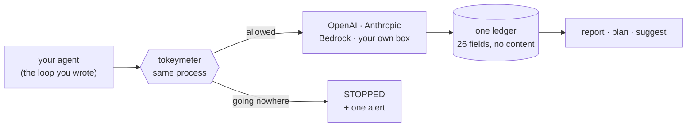

<div align="center">


# Tokeymeter

### Your agent looped thirty times. Your bill says it cost 1.5 cents.

[](https://github.com/NOVUE-ai/tokeymeter/actions)
[](https://pypi.org/project/tokeymeter/)
[](https://pypi.org/project/tokeymeter/)
[](https://github.com/NOVUE-ai/tokeymeter/blob/main/LICENSE)
[](https://github.com/NOVUE-ai/tokeymeter/blob/main/pyproject.toml)
[](https://github.com/NOVUE-ai/tokeymeter/tree/main/tests)

</div>

A stuck agent repeats itself, and repeats come from cache. So looping is nearly
free, your dashboard stays green, and the agent that failed silently looks
exactly like the one that worked.

Tokeymeter watches whether an agent is still getting anywhere, and stops it when
it isn't.

<!-- GIF SLOT — record with v0.29.1 or later, then uncomment:
     <p align="center"></p>
     Any recording made before v0.29.1 shows frames scrolling instead of
     replacing, which was a Windows console bug and not the product. -->

```bash
pip install tokeymeter
tokeymeter firstrun
```

Sixty seconds, offline, no API key, no account. You watch a stuck agent burn
40 calls and $1.05, then the same agent with one line added:

```
  WITHOUT A CEILING              WITH ONE LINE
    calls made          40         calls made          8    (was 40)
    spent           $1.0490        spent          $0.0754    (was $1.0490)
    tickets resolved     0

  ticket-88214 STOPPED
    1 distinct response in the last 8 calls while its input kept growing
    - it is paying more to learn nothing new
```

<p align="center">
  
</p>

---

## The number that started this

We pointed it at a real workload on a real OpenAI key. 98 requests, 22,811 input
tokens, $0.0038 — every figure reconciling exactly with the provider's own usage
page.

> [!IMPORTANT]
> **$0.0034 of that $0.0038 — 87% — went to six tasks that produced nothing.**

Nothing else in that stack could have told us. Not the invoice, not the traces,
not the framework. The six failures and the twelve successes were
indistinguishable everywhere except here — which is a polite way of saying the
agent failed, filed no complaint, and sent us a bill.

<p align="center">
  
  <br><sub><b>Real numbers from a real run against gpt-4o-mini.</b>
  <code>tokeymeter agents --html</code></sub>
</p>

---

## Contents

- [Why nothing else catches this](#why-nothing-else-catches-this)
- [Install](#install)
- [How it knows](#how-it-knows)
- [What you get](#what-you-get)
- [Setting the numbers](#setting-the-numbers)
- [One policy across every service](#one-policy-across-every-service)
- [Routing halts to Slack, Jira, anywhere](#routing-halts-to-slack-jira-anywhere)
- [What it can't catch](#what-it-cant-catch)
- [Cost](#cost)
- [Compliance and data residency](#compliance-and-data-residency)
- [Privacy and security posture](#privacy-and-security-posture)
- [Performance](#performance)
- [How it fits with what you already run](#how-it-fits-with-what-you-already-run)
- [Full API](#full-api)
- [Configuration](#configuration)
- [FAQ](#faq)
- [Stability, security, and roadmap](#stability-security-and-roadmap)

---

## Why nothing else catches this

| | Why it misses a stuck agent |
|---|---|
| **Your bill** | A repeat is served from cache. Measured: a 20-call loop cost $0.0155. It looks *cheap*. |
| **`max_iterations=25`** | Counts calls, not results. Twenty-five useless calls and twenty-five useful ones are identical to a counter. |
| **Langfuse / LangSmith** | Shows you the trace tomorrow, once you already know which task to open. |
| **An API gateway** | Sees 25 unrelated requests. A task is application context — it never crosses a network boundary, not even inside your own VPC. |
| **A spend cap** | Stops working agents too. Databricks' CTO built a circuit breaker that asks permission every $10, whether or not anything is wrong. |

Someone on X put the problem better than we could:

> *There are only three ways a loop dies. No stop condition. No progress check.
> No budget ceiling.*

Everyone who hit this built a stop condition and a budget ceiling.
**The progress check is the one nobody built.**

---

## Install

```bash
pip install tokeymeter
```

Python 3.9+. **Zero runtime dependencies.** Nothing in the package makes an
outbound network call, so there is no vendor for a security review to assess and
nothing to add to a DPA.

### Wrap your client once

```python
from openai import OpenAI
from tokeymeter.engines.execution.integrations import openai as tokeymeter_openai

client = tokeymeter_openai.wrap(OpenAI())
```

<details>
<summary>Anthropic, LangChain, Bedrock, or anything else</summary>

```python
# Anthropic
from tokeymeter.engines.execution.integrations import anthropic as tokeymeter_anthropic
client = tokeymeter_anthropic.wrap(Anthropic())

# LangChain / LlamaIndex
import tokeymeter
runtime = tokeymeter.wrap_langchain_llm(chat_model, model="gpt-4o")

# Anything else — Bedrock, Gemini, your own server, a raw HTTP call
from tokeymeter.engines.execution.integrations.universal import meter

invoke = meter(
    bedrock.invoke_model,
    model="claude-sonnet",
    text_fn=lambda a, k: k["body"]["messages"][-1]["content"],
    usage_fn=lambda r: (r["usage"]["input_tokens"], r["usage"]["output_tokens"]),
)
```
</details>

### Mark one unit of work

```python
import tokeymeter

with tokeymeter.task(f"ticket-{ticket.id}", agent="support"):
    agent.run(ticket)
```

Wrap the **agent entry point** — the function that handles one whole ticket, one
document, one job. Not individual model calls: progress is measured *across* the
calls in one unit of work, and one call has nothing to compare itself to.

That's the integration. Your framework, prompts, tools and retries are untouched.

### Try it without an API key

Paste this into a file and run it. Scripted model, nothing leaves your machine.

```python quickstart-runtime
import tokeymeter
from tokeymeter.storage import MemoryStore
from tokeymeter.engines.economics.usage import set_reported_usage

tokeymeter.set_default_store(MemoryStore())      # scratch, nothing persisted
tokeymeter.set_in_memory_savings(True)
tokeymeter.register_pricing("gpt-4o", input_per_1m=2.5, output_per_1m=10.0)


@tokeymeter.cache(model="gpt-4o")
def agent_turn(messages, tokens):
    # a stand-in for your model call: the tool is broken, so the answer never
    # changes, while the conversation history keeps growing
    set_reported_usage(tokens, 300)
    return "tool error: cannot parse attachment"


history = []
try:
    with tokeymeter.task("ticket-88214", agent="support",
                         stall_window=8, enforce=True) as t:
        for i in range(40):
            history.append(f"assistant: retrying, attempt {i}")
            agent_turn(tuple(history), 1100 + i * 420)
except tokeymeter.TaskStalled as exc:
    snap = t.snapshot()
    print(f"stopped after {snap['calls']} calls, ${snap['spend_usd']:.4f}")
    print(exc)

tokeymeter.set_in_memory_savings(False)
```

```
stopped after 8 calls, $0.0754
task 'ticket-88214' has stopped making progress: 1 distinct responses in the
last 8 calls while its input kept growing - it is paying more to learn nothing new
```

Without the ceiling that task runs all 40 calls and costs $1.0490.

### Where it sits



No proxy, no sidecar, no account. It is a checkpoint inside the caller, which is
also the only place a *task* exists: the API sees forty unrelated requests, and
your code knows they are one job.

Six more runnable examples are in [`examples/`](https://github.com/NOVUE-ai/tokeymeter/tree/main/examples) — every one works with
no API key and no network.

> Using a coding agent? Point it at [AGENTS.md](https://github.com/NOVUE-ai/tokeymeter/blob/main/AGENTS.md) and say *"add
> Tokeymeter task boundaries to my agent entry points."* It's written for that.

---

## How it knows

Two signals. Both are required.

**The answers stop being new.** A working agent returns new information each
turn. A stuck one returns the same thing. Responses are hashed — never read —
and the distinct count is divided by the executed calls.

```
working agent   8 distinct answers in 8 calls   progress 1.00
stuck agent     1 distinct answer  in 8 calls   progress 0.12
```

**The input keeps growing.** Novelty alone would condemn a batch classifier
returning "APPROVED" five hundred times. The difference is that a stuck
conversational agent re-sends its whole history every turn, so its input balloons
— measured at +3600% — while independent batch work stays flat.

```
call    input tokens    distinct answers    verdict
   2            1520              1 of 2    ok
   4            2360              1 of 4    ok
   6            3200              1 of 6    ok
   8            4040              1 of 8    STOPPED
```

**Stuck = paying more and more to learn nothing new.** Either signal on its own
is a false-alarm machine, and a false alarm gets a ceiling switched off inside a
week.

---

## What you get

### It stops, and says why

```python
try:
    with tokeymeter.task(f"ticket-{id}", agent="support",
                         stall_window=8, enforce=True):
        agent.run(ticket)
except tokeymeter.TaskStalled as exc:
    ticket.flag_for_human(reason=str(exc))
```

> [!TIP]
> Start without `enforce=True`. In record-only mode nothing is ever blocked — it
> just measures, and it cannot break anything. That recording is also what
> `--suggest` fits your thresholds to, so the cautious path is also the fast one.

### The report card

```
$ tokeymeter agents

agent                tasks  med $/task     p95  calls  progress  stalled
service-diagnostic      18      0.0001  0.0007    5.0      0.16      6 !
warranty-triage         10      0.0000  0.0000    5.0      0.50        0

service-diagnostic: 6 task(s) stopped making progress while their input kept
growing ($0.0034)
   diag-broken-0    progress 0.07  input +134%  14 calls  $0.0007
```

<p align="center">
  
</p>

Note `warranty-triage`: **0.50 progress and zero stalls.** That is a batch
classifier repeating three labels — doing its job perfectly, and repeating itself
while doing it. Low progress with *flat* input is normal work, and a tool that
cannot tell the difference is a tool nobody keeps.

```bash
tokeymeter agents --html report.html    # one file you can send to your lead
tokeymeter agents --json                # for your own tooling
```

The HTML report is self-contained — no server, no account, and it makes no
network request when opened. It leads with what the stalls cost, states the rule
that flagged them, and states what it could and couldn't see.

<p align="center">
  
  <br><sub>Every stalled task named, with what it cost. The next click is your trace viewer.</sub>
</p>

### Watch it happen

```
$ tokeymeter watch

  ticket-88214  support    call  12  $ 0.1383  █···  0.12
  order-1102    checkout   call   4  $ 0.0228  ████  1.00
  doc-4471      extract    call   6  $ 0.0065        .     5 cached

  ticket-88214 STALLED - 1 distinct answer in 8 calls, input +64%

  5 tasks - $0.2132 spent - 1 stalled
```

Reads the ledger. Opens no port, starts no server, and killing it cannot affect a
running agent. `--replay --speed 3` runs it against yesterday's history at speed.
`--json` streams one event per line.

---

## Setting the numbers

The hard question after installing is *what should `stall_window` be?* Guess low
and healthy work dies; guess high and the runaway slips through. So most people
set nothing, and a ceiling nobody sets protects nobody.

```
$ tokeymeter agents --suggest

  service-diagnostic  17 tasks, 5 stalled, healthy progress 1.00-1.00
      stall_window 4  -> would have caught 5, 0 false positives
          longest legitimate repeat run seen: 1 (3 calls of headroom)
      envelope 0.0011  -> would have caught 5, 0 false positives

  warranty-triage     10 tasks, healthy progress 0.50-0.50
      no task in this window shows the stalled shape, so there is
      nothing to tune against. A ceiling suggested here would be a guess.
```

Every value is **replayed against your own history** and reported with the two
numbers that decide it: stalled tasks it would have caught, and healthy tasks it
would also have stopped. Zero false positives is a hard requirement — a ceiling
that kills working tasks gets switched off, and then it protects nothing.

**Where the data can't support a recommendation, it says so instead of inventing
one.** Anything can print a number; refusing to is the harder half.

### Is it getting worse?

```
$ tokeymeter agents --since 7d --compare

  extract               <-- regressed
      calls/task   6.4 -> 11.2  +75% !
      $/task       0.046 -> 0.081  +76% !
      progress     1 -> 0.88  -12% !
      stalled      0 -> 2 !
```

An agent quietly going from 6 calls a task to 11 costs real money and looks
completely normal in any single snapshot. Regression is the failure that never
announces itself.

---

## One policy across every service

Move the numbers out of code and into a file your platform team owns.
Hot-reloaded, no deploy.

```yaml
version: 1
rules:
  - name: agent-guard
    then: {envelope: 2.00, reserve: 0.10, stall_window: 8, enforce: true}

  - name: non-production-is-cheap
    when: {env: [dev, ci]}
    then: {envelope: 0.25}

  - name: checkout-is-protected
    when: {agent: checkout}
    then: {enforce: false}
```

Conditions: `agent`, `env`, `task_id`, `principal`, `data_class`, `region`,
`endpoint`. Actions: `envelope`, `reserve`, `max_calls`, `max_repeats`,
`stall_window`, `min_novelty`, `enforce`, plus the compliance actions below.
Between the file and your code, **the most restrictive wins** — neither side can
loosen what the other set.

### See what a rule would do before you apply it

```
$ tokeymeter plan --policy ai-execution.yaml --protect checkout --since 30d

Against the last 30 days:
  312 tasks seen, 29 would halt, 283 would complete
  $1,203.4400 avoided of $4,911.0200 in window

  by agent:
    service-diagnostic     26 halted   $1,180.22 avoided
    checkout                3 halted   $  23.22 avoided   <-- PROTECTED

Coverage: 94.2% of executed spend is task-attributed
```

Exit codes are for CI: **0** clean, **2** a protected agent would halt, **1**
policy error.

```yaml
- name: AI execution policy check
  run: tokeymeter plan --policy ai-execution.yaml --protect checkout
```

The simulation is checked against live enforcement in the test suite: 27
predicted halts, 27 actual, **$0.00000000** error on avoided spend.

---

## Routing halts to Slack, Jira, anywhere

Register one handler, process-wide. It fires once per halted task.

```python
import json, tokeymeter
from urllib.request import urlopen, Request

@tokeymeter.on_halt
def notify(halt):
    urlopen(Request(SLACK_WEBHOOK_URL,
                    data=json.dumps({"text": halt.summary()}).encode(),
                    headers={"Content-Type": "application/json"}))
```

```
support/ticket-88214 stopped after 8 calls ($0.0720) - stalled,
progress 0.12, input +107%
```

The event carries identifiers, counts and money — no prompt, no response — so
it's safe to put in a channel by construction.

**It fires even when your code swallows the exception.** `TaskLimitExceeded`
subclasses `RuntimeError`, so ordinary retry code catches it. Measured on one
stuck agent: 22 halts swallowed, the task correctly bounded at 8 calls, and
nothing upstream any the wiser. Notification therefore fires where the halt is
*decided*, not where it's raised. It also fires in record-only mode, with
`enforced=False`, so an alert never confuses *"stopped"* with *"would have been
stopped"*.

<details>
<summary>Why there are no bundled connectors</summary>

Each would mean an HTTP dependency, an auth scheme and a token store in a package
that currently has none — and "no dependencies" is why a security team can
approve this in an afternoon. Use the client you already have configured:

```python
@tokeymeter.on_halt
def notify(halt):
    jira.create_issue(project="OPS", summary=f"Agent stalled: {halt.task_id}",
                      description=halt.summary())
```

A handler that raises is swallowed and counted; one that fails repeatedly is
retired with a loud log rather than burning latency on every halt forever. A
broken alert never becomes a broken agent.
</details>

---

## What it can't catch

**An agent that's varied but useless.** Different search each time, different
file each time, all of it failing. Progress reads 1.00 and it runs to completion.

That's structural, not a bug: novel output is indistinguishable from useful
output without knowing the goal, and knowing the goal means reading the prompt —
the one thing this doesn't do. Use `envelope` or `max_calls` for that case.

**Non-deterministic errors.** `"failed at 03:14:22"` looks new every time. Most
tool errors are fixed strings; not all.

**Whether the ticket was actually answered.** It detects that an agent stopped
producing new information, not that it failed. Those overlap heavily — a stuck
agent is nearly always a failing one — but they are not the same claim.

Sorting twenty-two real "my agent burned money" posts, this would have caught
**about half** — the mechanical half, where a tool is broken and the agent
doesn't know to stop.

### Not for you if

> [!WARNING]
> **You're paying for Claude Code, Cursor or Codex.** Those tokens are the
> vendor's; there is no call site in your repo to wrap. This works on agents you
> wrote, not agents you bought.
>
> **You make single-shot calls** — one prompt, one answer. Nothing to stall. You
> would still get caching and cost tracking, but the part that makes this
> different would not apply. Better you know now than in week two.

---

## Cost

The bill dropping is a consequence, not the pitch.

**When it fires, it's large.** A stalled task in the shipped demo goes from 40
calls and $1.0490 to 8 calls and $0.0754 — a 93% reduction *on that task*.

**Across a healthy month it's small.** You only save on tasks that were going
nowhere. If none are, you save nothing, which is the correct outcome.

It doesn't make your calls cheaper. It stops the calls that shouldn't happen —
and an agent going nowhere is 100% waste, not 30%.

You also get the number nobody had: **cost per task**, per agent.

```python
tokeymeter.chargeback_report(group_by=("agent",))
tokeymeter.general_ledger_csv(...)     # mapped to your GL accounts
tokeymeter.close_packet(...)           # self-reconciling month close
```

<details>
<summary>The optimization engine (all opt-in)</summary>

Exact caching and single-flight deduplication are on by default — that's why
repeats are free, and why the loop is invisible to your bill in the first place.

The rest is off until you ask for it:

```python
@tokeymeter.cache(model="gpt-4o", semantic=True, ttl=3600,
                  compressor=tokeymeter.SafeCompressor())
```

Semantic caching with false-positive monitoring, four prompt compressors, a
router, and cascade-and-escalate. Useful, well tested, and not what this library
is for.
</details>

---

## Compliance and data residency

Rules about **what is permitted**, not just how much.

```yaml
- name: phi-handling
  when: {data_class: PHI}
  then: {only: [gpt-4o-secure], never_cache: true, record_outcome: true}

- name: eu-residency
  when: {region: EU}
  then: {only_endpoints: [azure-westeurope], record_outcome: true}
```

```python
with tokeymeter.data_class("PHI"), tokeymeter.region("EU"):
    agent.run(record)          # a forbidden model is refused before the call
```

`data_class` and `region` are **declared by your application, never inferred** —
inferring means reading the prompt. The honest consequence, stated up front:
enforcement is on the declared class, so if your app tags a PHI case as
`general`, the wrong rule is faithfully enforced. Every record says *"the declared
rule was applied to the declared class"*, never *"we verified the content"*.

**A model allowlist can't express residency** — `gpt-4o` runs in eastus *and*
westeurope, so `only_endpoints` restricts where a call is **processed**. An
undeclared endpoint is refused under a residency rule, because *"we don't know
where this went"* is not evidence that it stayed in the EU.

### The auditor's question, answered from the ledger

```python
>>> tokeymeter.policy_report()
{'by_data_class': {'PHI': {'calls': 20, 'models': ['gpt-4o-secure']}},
 'by_region':     {'EU':  {'calls': 81, 'endpoints': ['azure-westeurope']}},
 'governed_calls': 101, 'ungoverned_calls': 0}
```

*"Prove PHI never reached an unapproved model"* — that's the exhaustive list, not
a promise.

Six starter policies ship as **data you read and commit**, never auto-installed:
`hipaa-phi-handling`, `eu-data-residency`, `data-residency-multi-region`,
`pii-minimisation`, `runaway-agent-guard`, `dev-and-ci-caps`.

**Known gap:** EU AI Act Article 14 asks for demonstrable human oversight. This
provides halting, not approval queues. For a high-risk classification, stopping
may not satisfy the requirement.

---

## Privacy and security posture

- **No prompt or response text is ever stored.** 26 record fields, all
  identifiers, counts, money and hashes. Responses are hashed for the progress
  signal and discarded.
- **Nothing leaves your process.** No proxy, no sidecar, no telemetry, no
  account, no phone-home. Zero runtime dependencies.
- **No subprocessor.** There is no vendor in your data path to add to a DPA or a
  disclosure list.
- **Fails open.** If the meter breaks, traffic flows. The single exception is
  compliance enforcement, which fails closed — but narrowly: a ruleset that fails
  to *resolve* contributes nothing, so a bug degrades to "no policy", never to
  "deny everything".
- **A refusal is never bypassed.** Fail-open exists so a bug in metering can't
  break your request. It does not apply to a deliberate refusal — that would make
  the call anyway, off-meter.
- **Tamper-evident.** Append-only audit chain with independently verifiable
  proofs, plus package integrity verification.

```bash
tokeymeter doctor    # verdict, overhead percentiles, ledger and integrity health
```

---

## Performance

Measured on the CI machine, cache-hit path, 3,000 samples:

| | p50 | p95 |
|---|---|---|
| Baseline (no task boundary) | 60.9 µs | 94.2 µs |
| Task boundary + stall detection | 85.8 µs | 128.0 µs |
| Policy with no compliance rules | +1.9 µs | |

Scale, measured:

- 20,000 tasks: zero leaked state, 60 MB RSS
- 500 concurrent async tasks: 500 distinct ids, zero cross-contamination
- 64 threads × 1,000 tasks: zero cross-contamination
- Real file ledger: 7,843 tasks/s
- 220,000 records through `--suggest`: 1.13 s
- Five processes writing while reports read: zero errors

`tokeymeter doctor` measures all of this on *your* machine. Ours is not the one
your agents run on.

---

## How it fits with what you already run

**Keep your observability.** 89% of teams running agents already have it.
Langfuse tells you *why* a task went wrong; this tells you *which one*, and stops
it. The report card names the stalled tasks — the next click is your trace viewer.

**Keep your framework.** LangChain, CrewAI, LlamaIndex or hand-rolled. This bounds
the loop; it doesn't build it.

**Keep your gateway.** It caps a request. This caps the work. Both are useful, and
neither substitutes.

**Cheaper models help too.** Substitution saves more per call than optimization
ever will. But a cheaper model that loops thirty times still loops thirty
times and still returns nothing. Cheaper models make runaway agents cheaper, not
safer.

---

## Full API

<details>
<summary>The twenty names that are the product</summary>

```python
tokeymeter.PRIMARY_API     # the shortlist
tokeymeter.primary_api()   # with one-line descriptions
```

| | |
|---|---|
| `cache`, `cache_stream` | the decorator |
| `task`, `bind_task`, `TaskLimitExceeded` | the boundary |
| `on_halt`, `HaltEvent` | routing |
| `register_pricing`, `register_cluster_costs` | pricing |
| `load_rules_file`, `set_rules` | policy |
| `agent_report`, `plan_report`, `savings_report` | reporting |
| `chargeback_report`, `close_packet`, `general_ledger_csv` | finance |
| `data_class`, `region`, `policy_report` | compliance |
| `doctor`, `verify_self` | health |

193 public names in total; the rest is depth. `bind_task` matters if you use
threads: `contextvars` propagate into asyncio automatically but **not** into
`ThreadPoolExecutor` workers, so a plain worker would otherwise escape the ceiling
silently.
</details>

<details>
<summary>Ceilings, and what each one is for</summary>

| | Stops when | Catches |
|---|---|---|
| `stall_window=8` | answers stop being new **and** input grows | the mechanical runaway |
| `envelope=2.00` | the task has spent $2 | anything expensive, including varied exploration |
| `max_calls=50` | 50 calls, whatever they cost | anything long |
| `max_repeats=4` | the same request 4 times | identical retries |

They are orthogonal on purpose. **An envelope can never catch a loop** — after the
first execution every repeat is a cache hit, so a 20-call loop costs $0.0155 and
never approaches any budget. `reserve` makes the envelope a hard cap by holding the
worst case before the call and settling after — the way a hotel holds a card, and
for the same reason: the bill arrives after the damage.
</details>

<details>
<summary>Exceptions</summary>

```
RuntimeError
├── TaskLimitExceeded
│   ├── TaskStalled            progress collapsed while input grew
│   ├── TaskLoopDetected       max_repeats
│   ├── TaskEnvelopeExceeded   envelope
│   └── TaskCallLimitExceeded  max_calls
└── PolicyViolation
    ├── ModelNotPermitted      wrong model for this data class
    └── EndpointNotPermitted   wrong place to process it
```

`PolicyViolation` is deliberately not a `TaskLimitExceeded`: running out of budget
and violating a data-handling rule fail for different reasons, are owned by
different people, and need different handling.
</details>

---

## Configuration

### Optional extras

The base install has no dependencies. Add only what you use:

```bash
pip install "tokeymeter[providers]"     # openai, anthropic SDKs
pip install "tokeymeter[semantic]"      # paraphrase matching (~1GB)
pip install "tokeymeter[scale]"         # redis, sqlite-vec, encrypted cache
pip install "tokeymeter[compression]"   # llmlingua prompt compression
pip install "tokeymeter[audit]"         # Ed25519 signing for the audit chain
pip install "tokeymeter[dev]"           # to run the test suite
```

### Environment variables

| | |
|---|---|
| `TOKEYMETER_HOME` | where the ledger and config live. Default: `~/.tokeymeter` |
| `TOKEYMETER_SAVINGS_PATH` | the ledger file specifically, overriding `HOME` |
| `TOKEYMETER_ENV` | the `env` a policy rule can match on — `dev`, `ci`, `prod` |
| `TOKEYMETER_QUIET` | suppress non-error console output |

Precedence: an explicit `set_savings_path()` beats `TOKEYMETER_SAVINGS_PATH`,
which beats `TOKEYMETER_HOME`.

### Where the ledger lives

One append-only JSONL file per machine, written by every process that imports the
library. Several services can share one file safely — a torn final line from a
concurrent write is skipped and re-read, not treated as corruption.

```python
tokeymeter.set_savings_path("/var/log/tokeymeter/ledger.jsonl")
tokeymeter.set_buffered_savings(True)     # fewer file opens; helps on Windows
                                          # where antivirus scans every open
```

For the cache itself, in-memory is the default:

```python
from tokeymeter.storage import MemoryStore, SQLiteStore          # both built in
from tokeymeter.engines.optimization.redis_store import RedisStore   # [scale]

tokeymeter.set_default_store(SQLiteStore("/var/lib/tokeymeter/cache.db"))
```

### Checking your install

```bash
tokeymeter doctor        # verdict, overhead, ledger and integrity health
python ACCEPTANCE.py     # walks the whole journey, reports PASS/FAIL and friction
```

`ACCEPTANCE.py` exists because a green test suite tells you the code is correct
and cannot tell you the product is usable.

---

## FAQ

**Do I have to change my agent?** One line at the entry point. Nothing inside it.

**What if the meter breaks?** Traffic flows. Everything fails open except
compliance, and that inversion is kept as narrow as it can be.

**Does it work with async and streaming?** Yes, both, including `cache_stream`.
Every control is verified on all four execution routes — sync, async, streaming,
and the runtime kernel.

**Can it run in a bank?** That's what the design is for: no prompt storage, no
outbound calls, no subprocessor, an audit chain, and package integrity you can
verify yourself.

**How do I know the report is right?** `--suggest`, `agents`, `plan` and live
enforcement all read one ledger and are tested to agree exactly — including across
five processes writing concurrently to a deliberately corrupted file. And the
ledger reconciles with a real provider invoice: 98 requests, 22,811 tokens,
$0.0038, matching OpenAI's own usage page.

**Is it production ready?**

> [!NOTE]
> 1,758 tests, a 17-check release gate, and nine
> adversarial audits that each found and fixed real defects — three of them found
> only by running it against a real provider with real money. But be aware: **no
> one outside the project has run it against a workload we didn't write.** If
> that matters to you, wait. If it interests you, open an issue — you will get
> answers fast.

---

## Stability, security, and roadmap

### Versioning

Pre-1.0, so the public API can still change. Two things reduce the risk: a
frozen-signature test guards `cache()`, `cache_stream()` and the export list, so
any change to them is deliberate and appears in [CHANGELOG.md](https://github.com/NOVUE-ai/tokeymeter/blob/main/CHANGELOG.md); and
new parameters are appended to the end of signatures rather than inserted, so
positional arguments never shift underneath you.

The `PRIMARY_API` list is the surface intended to stay stable.

### Reporting a security issue

Please don't open a public issue for a vulnerability. Email the maintainers and
you'll get an acknowledgement within a few days. See [SECURITY.md](https://github.com/NOVUE-ai/tokeymeter/blob/main/SECURITY.md).

Worth knowing before you look: the package makes no outbound network calls, holds
no credentials, and stores no prompt or response text. The attack surface is
mostly what an attacker could do with **write** access to a policy file — a policy
file is executable authority over your agents, so it belongs under CODEOWNERS like
any other control.

### Roadmap

**Being worked on:** a docs page of copy-paste `on_halt` recipes for Slack, Teams,
Jira, Linear and PagerDuty; OpenTelemetry span attributes so cost-per-task and
progress show up in Datadog, Grafana or Honeycomb without a separate integration.

**Deliberately not planned:** bundled connectors for individual SaaS tools; a
hosted dashboard; and anything that puts a network hop in your request path.

**Known gaps, stated in full above:** agents that are varied but useless aren't
detected; EU AI Act Article 14 wants approval queues and this provides halting;
and nobody outside the project has run it against a workload we didn't write.

---

## Contributing

Issues and pull requests welcome. The most valuable report you can file is **a
working agent that got stopped** — there's an issue template for it, and it's
treated as a priority bug rather than a tuning question.

```bash
pip install -e ".[dev]"
pytest
python scripts/run_all_checks.py
```

Two rules that aren't obvious:

**Every control must work on all four execution routes** — sync decorator, async
decorator, `cache_stream`, and the runtime kernel. A control that exists on one
path is only as strong as the path a team happens to pick. Three separate bugs of
exactly this shape have been found and fixed.

**Enforcement and simulation move together.** If you add a control, add it to
`simulate` in the same commit. Otherwise `plan` reports that a real rule does
nothing, someone applies it believing that, and production halts.

See [CONTRIBUTING.md](https://github.com/NOVUE-ai/tokeymeter/blob/main/CONTRIBUTING.md) for what will get a change rejected.

---

## License

Apache-2.0.
